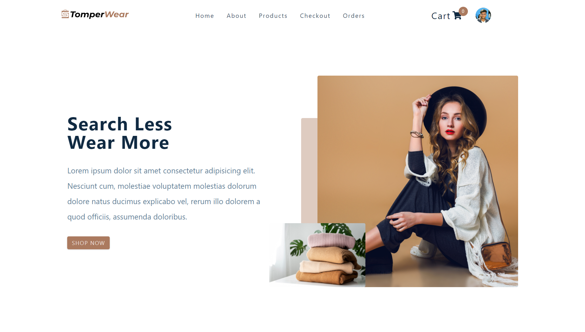

<p align='center'>

</p>
<p align='center'>
<b>E-commerce web-application for selling clothing essentials</b>
</p>
<p align='center'>
<a href='https://tomper-wear.netlify.app/' target='_blank'>tomper-wear.netlify.app</a>
</p>

---

<p align='center'>
This is the frontend of TomperWear build with MERN stack and deployed with <a href='https://www.netlify.com/' target='_blank'>Netlify</a>
</p>

<p align='center'>

</p>

## 🚀 Link to [Admin panel](https://github.com/varunKT001/tomper-wear-ecommerce-admin), [Backend](https://github.com/varunKT001/tomper-wear-ecommerce-backend)

## 📷 Link to [Screenshots](./SCREENSHOTS.md)

## 🎥 Link to [Video demo](https://youtu.be/5oGqxtSN0jY)

## 🧾 Description

TomperWear is an E-commerce platform for small bussiness owners who want to expand their bussiness by providing an online purchase solution to their customers.

## ✨ Features

#### Client

Users shopping through this platform enjoys following features:

- [x] User authentication using google firebase.
- [x] Secure payments via stripe.
- [x] Users can change their username and display image.
- [x] Users can filter products on various parameters.
- [x] Users can sort products according to price and name.
- [x] Users can add products to cart.
- [x] Users can order products by providing their shipping information and card details for payments.
- [x] Users can view their order's status and their previous orders.
- [x] Users can review the products (or update their previous reviews) and benefit other customers.
- [x] Users can send feedbacks to the owner.
- [x] Responsive for all screen sizes.

#### Admin

The admin panel of TomperWear contains three classes of admins:

**1. Super privileged admin**
Super privileged admins are the topmost in the hierarchy. They have the following permissions:

- [x] Can view, create, update, and delete admin users.
- [x] Can view, create, update, and delete products.
- [x] Can view orders and update their status.
- [x] Can delete orders.

This is privilege is ideal for the owner(s) of the bussiness.

**2. Moderate privileged admin**
Moderate privileged admins comes below Super privileged admins. They have the following permissions:

- [ ] Can view, create, update, and delete admin users.
- [x] Can view, create, update, and delete products.
- [x] Can view orders and update their status.
- [x] Can delete orders.

This is privilege is ideal for the manager(s).

**3. Low privileged admin**
Low privileged admins are the lowermost in the hierarchy and have the least amount of privileges. The have the following permission:

- [ ] Can view, create, update, and delete admin users.
- [ ] Can view, create, update, and delete products.
- [x] Can view orders and update their status.
- [ ] Can delete orders.

This is privilege is ideal for the delivery-agent(s).

**Here is a table dipicting the admin privileges for better clarity**

<table>
<thead>
  <tr>
    <th> </th>
    <th colspan="4">Admins</th>
    <th colspan="4">Product</th>
    <th colspan="3">Orders</th>
  </tr>
</thead>
<tbody>
  <tr>
    <td></td>
    <td><b><u>view</u></b></td>
    <td><b><u>create</u></b></td>
    <td><b><u>update</u></b></td>
    <td><b><u>delete</u></b></td>
    <td><b><u>view</u></b></td>
    <td><b><u>create</u></b></td>
    <td><b><u>update</u></b></td>
    <td><b><u>delete</u></b></td>
    <td><b><u>view</u></b></td>
    <td><b><u>update</u></b></td>
    <td><b><u>delete</u></b></td>
  </tr>
  <tr>
    <td><b>Super</b></td>
    <td>✔</td>
    <td>✔</td>
    <td>✔</td>
    <td>✔</td>
    <td>✔</td>
    <td>✔</td>
    <td>✔</td>
    <td>✔</td>
    <td>✔</td>
    <td>✔</td>
    <td>✔</td>
  </tr>
  <tr>
    <td><b>Moderate</b></td>
    <td>-</td>
    <td>-</td>
    <td>-</td>
    <td>-</td>
    <td>✔</td>
    <td>✔</td>
    <td>✔</td>
    <td>✔</td>
    <td>✔</td>
    <td>✔</td>
    <td>✔</td>
  </tr>
  <tr>
    <td><b>Low</b></td>
    <td>-</td>
    <td>-</td>
    <td>-</td>
    <td>-</td>
    <td>-</td>
    <td>-</td>
    <td>-</td>
    <td>-</td>
    <td>✔</td>
    <td>✔</td>
    <td>-</td>
  </tr>
</tbody>
</table>

## ⚙ Tools and Technologies used

#### [Client](https://github.com/varunKT001/tomper-wear-ecommerce)

1. [React.js](https://reactjs.org/)
2. [React-icons](https://react-icons.github.io/react-icons/)
3. [Styled-Components](https://styled-components.com/)
4. [Firebase](https://firebase.google.com/)
5. [Stripe](https://stripe.com/)
6. [Formspree](https://formspree.io/)

#### [Admin panel](https://github.com/varunKT001/tomper-wear-ecommerce-admin)

1. [React.js](https://reactjs.org/)
2. [Chakra-ui](https://chakra-ui.com/)
3. [React-icons](https://react-icons.github.io/react-icons/)

#### [Backend](https://github.com/varunKT001/tomper-wear-ecommerce-backend)

1. [Node.js](https://nodejs.org/en/)
2. [Express.js](https://expressjs.com/)
3. [MongoDB](https://www.mongodb.com/)
4. [JWT](https://jwt.io/)
5. [Cloudinary](https://cloudinary.com/)
6. [Bcrypt.js](https://github.com/dcodeIO/bcrypt.js)
7. [Stripe](https://stripe.com/)

## 🛠 Installation and setup

1. Clone the repo to your local machine.
2. Install the required dependency for server using :

   ```javascript
   npm install
   ```

3. Create a .env file inside the root folder and provide the following environment variables:

   ```env
   REACT_APP_BACKEND_HOST=<backend_url>
   REACT_APP_FORMSPREE=<formspree_id>
   REACT_APP_API_KEY=<firebase_api_key>
   REACT_APP_AUTH_DOMAIN=<firebase_auth_domain>
   REACT_APP_PROJECT_ID=<firebase_project_id>
   REACT_APP_STORAGE_BUCKET=<firebase_storage_bucket_url>
   REACT_APP_MESSAGING_SENDER_ID=<firebase_messaging_sender_id>
   REACT_APP_APP_ID=<firebase_app_id>
   REACT_APP_STRIPE_PUBLIC_KEY=<stripe_public_key>
   ```

4. Start the dev server using :

   ```javascript
   npm start
   ```

## 🏎 Creating production built

1. Create a production ready react app using the command :

   ```javascript
   npm run build
   ```

## 🤝 Test user credentials

| **E-mail**          | **Password** |
| ------------------- | ------------ |
| bob@tomperwear.com  | bob1212      |
| test@tomperwear.com | test1212     |

## 😎 Team Members

1. Varun Kumar Tiwar - 2020IMT-112

<br>
<br>
<br>

<p align='center'>
(If you liked the project, give it star 😃)
</p>
